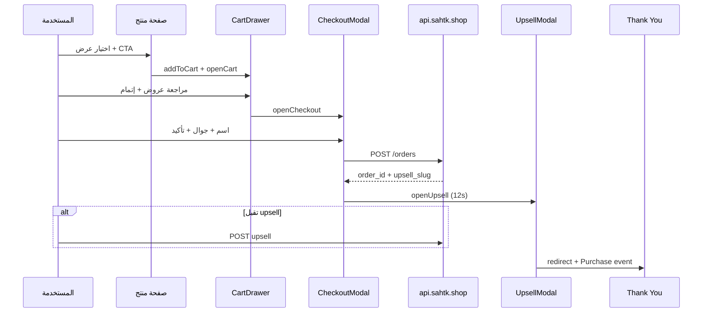

# تدفق الدفع والتحويل

## مخطط التدفق



## التحقق من الجوال السعودي

### الصيغ المقبولة (إدخال المستخدم)

- `0501234567` (10 أرقام)
- `501234567` (9 أرقام)
- `+966501234567`
- `966501234567`
- مع مسافات/شرطات: `050 123 4567`

### التطبيع (للتخزين والـ API)

```typescript
export function normalizeSaudiPhone(raw: string): string {
  let d = raw.replace(/[\s\-().]/g, "");
  if (d.startsWith("+")) d = d.slice(1);
  if (d.startsWith("00")) d = d.slice(2);
  if (d.startsWith("0") && d.length === 10) d = "966" + d.slice(1);
  if (d.startsWith("5") && d.length === 9) d = "966" + d;
  return d; // 9665XXXXXXXX
}
```

### Regex بعد التطبيع

```typescript
const SAUDI_MOBILE = /^966(5[013456789][0-9]{7})$/;
```

**رسالة خطأ:** `أدخل رقم جوال سعودي صحيح يبدأ بـ 05`

### zod schema

```typescript
export const checkoutSchema = z.object({
  customerName: z.string().min(2, "الاسم مطلوب (حرفان على الأقل)"),
  phone: z.string().min(1).transform(normalizeSaudiPhone).refine(
    (v) => SAUDI_MOBILE.test(v),
    { message: "أدخل رقم جوال سعودي صحيح يبدأ بـ 05" }
  ),
});
```

### عرض للمستخدم

احفظ داخلياً `9665...` — اعرض في UI بصيغة `05XXXXXXXX` إن أردت.

---

## CheckoutModal — عناصر الثقة

داخل النافذة قبل الزر:

- ✓ دفع عند الاستلام
- ✓ تأكيد هاتفي خلال 30 دقيقة
- ✓ +12,000 عميلة (قابل للتحديث)
- شارة ندرة: «🔥 14 عميلة يطلبن الآن»

---

## Upsell (10–15 ثانية)

| إعداد | قيمة |
|-------|------|
| المدة | 12000 ms (config `UPSELL_TIMEOUT_MS`) |
| السعر | 99 ر.س |
| النص | انظر 03-copywriting |
| بعد الرفض | لا تعيد العرض في نفس الجلسة |

```typescript
sessionStorage.setItem("sahtk_upsell_seen", "1");
```

---

## Thank You Page

- Query: `?order_id=uuid`
- اجلب ملخص من `sessionStorage.sahtk_last_order` أو `GET /api/orders/{id}` (عام محدود: رقم الطلب + المجموع فقط)
- `trackEvent("Purchase", { value, orderId, phone, sendCapi: true })`
- **مرة واحدة:** `sessionStorage` flag `purchase_tracked`

---

## حالات الخطأ

| الحالة | UX |
|--------|-----|
| API down | «تعذر الإرسال — حاولي مرة أخرى أو تواصلي واتساب» |
| رقم غير صالح | تحت الحقل بالعربي |
| سلة فارغة | إخفاء checkout |

---

## تأكيد COD (لاحقاً — اختياري)

Backend status flow:
`pending_confirmation` → `confirmed` → `shipped`

يمكن ربط واتساب API لاحقاً — ليس في النطاق الأول.
